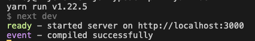

Nextjs boilerplate using Typescript with modestly opinionated configuration to make real world Nextjs applications less cumbersome to spin up.

## Getting Started

Clone the project using Git.

```sh
$ git clone https://github.com/blujedis/nextjs-typescript your_app_name
```

> Once cloned cd into the directory you defined above and then install.

```sh
cd your_app_name && npm install
```

## Running Project

Once installed start up the project to ensure all is well.

```sh
$ npm run dev
```

> After booting the project you'll something similar to the following.



## How to Use Scaffolding

Click below for additional README docs explaining the structure of the project and how to customize/implement features.

See [Documentation](fixtures/docs/MAIN.md)

## Code Docs

Full code implementation.

See [https://blujedis.github.io/nextjs-typescript](https://blujedis.github.io/nextjs-typescript/)

## Change

See [CHANGE.md](CHANGE.md)

## License

See [LICENSE](LICENSE)